# Reefy Video AI Bench

We measured maximum performance and power consumption of the Intel integrated
GPU and Intel AI Boost NPU in an Intel Core Ultra 7 256V system, then compared
them with an Nvidia GeForce RTX 5060 Ti GPU. The task is a fully
hardware-accelerated video stream pipeline: H.264 decode, preprocessing, and
YOLO-NAS object detection.

In our results, the Intel iGPU delivered 4.8x better FPS/W than the Nvidia GPU,
while the Intel NPU delivered 11.1x better FPS/W. This makes the Intel NPU the
best fit among the tested devices for power-efficient AI applications that
target video understanding.

## Core Pipeline

1. Decode a video file as fast as possible.
2. Resize and convert frames to the model input format.
3. Run YOLO-NAS object detection.
4. Count detections and collect latency, CPU, GPU, and power telemetry.

## Sample Video Clip

We used
[VIRAT_S_050203_07_001288_001531.mp4](samples/VIRAT_S_050203_07_001288_001531.mp4),
a public CCTV clip from the [VIRAT Video Dataset](https://viratdata.org/).
It is a VIRAT Release 2.0 stationary surveillance clip: 1920x1080, H.264,
yuv420p, 30000/1001 FPS, 242.94s, 310.9 MB.

## Model

We used a [YOLO-NAS](https://github.com/Deci-AI/super-gradients/blob/master/YOLONAS.md)
small object-detection model exported to
[models/yolo_nas_s.onnx](models/yolo_nas_s.onnx), with COCO labels from
[labels/coco-80.txt](labels/coco-80.txt). The model input is `uint8` NCHW
`[1, 3, 320, 320]`.

## Hardware Configurations

### Intel Core Ultra 7 256V System

Observed from OpenVINO inside the benchmark container:

```text
OpenVINO: 2025.3.0
CPU: Intel(R) Core(TM) Ultra 7 256V
GPU: Intel(R) Graphics [0x64a0] (iGPU)
NPU: Intel(R) AI Boost
```

Process node: Lunar Lake's compute tile, which contains the CPU cores, iGPU,
and NPU, is reported as TSMC N3B, a 3 nm-class process; the platform
controller tile is TSMC N6, a 6 nm-class process
([source](https://www.tomshardware.com/pc-components/cpus/intels-lunar-lake-intricacies-revealed-in-new-high-resolution-die-shots)).

Host NPU proof:

```text
/dev/accel/accel0 exists
/sys/class/accel/accel0 exists
intel_vpu kernel module loaded
```

Wall power was measured with no other payload containers running:

```text
idle: 4.3 W
NPU benchmark load: 14.8 W
```

### Nvidia RTX 5060 Ti System

Observed from the host:

```text
CPU: AMD Ryzen 5 5600X 6-Core Processor
```

Observed from `nvidia-smi`:

```text
GPU: NVIDIA GeForce RTX 5060 Ti
driver: 595.45.04
CUDA reported by driver: 13.2
```

Process node: Nvidia GeForce RTX 50-series GPUs are reported as TSMC 4N, a
custom 5 nm-class process
([source](https://en.wikipedia.org/wiki/GeForce_RTX_50_series)).

Benchmark container:

```text
nvidia/cuda:12.6.3-cudnn-runtime-ubuntu24.04
ONNX Runtime GPU: 1.22.0
CUDAExecutionProvider
```

Wall power was measured with no other payload containers running:

```text
idle: 48.2 W
Nvidia benchmark load: 178.0 W
```

## OS

Both systems booted into the [Reefy.ai](https://reefy.ai) Linux distribution
with kernel `6.18.36`.

## CPU Governor Settings

All published benchmark runs used the default CPU power policy:

```text
scaling_governor: powersave
energy_performance_preference: balance_performance
```

## Physical Setup

Wall power was measured with plug-in wall meters while no unrelated payloads
were running. The idle readings below are the baselines used for FPS/W
calculations.

Intel Core Ultra system idle baseline, 4.3 W:

<a href="docs/images/intel-core-ultra-wall-meter-idle.jpeg">
  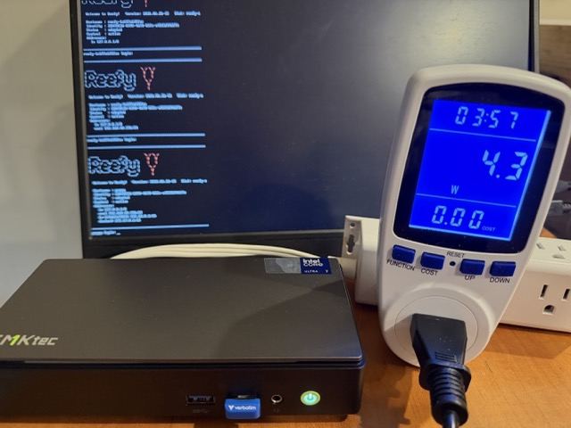
</a>

Nvidia RTX 5060 Ti system idle baseline, 48.2 W:

<a href="docs/images/nvidia-rtx5060ti-wall-meter-idle.jpeg">
  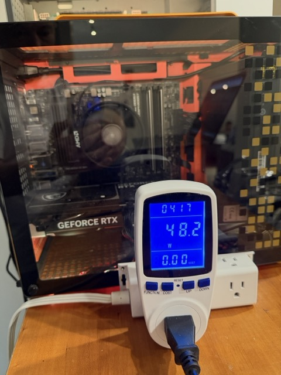
</a>

## Pipelines And How To Run

### Nvidia GPU

```text
H.264 file -> FFmpeg CUDA decode -> scale=320:320,format=bgr24
-> Python frame reader -> ONNX Runtime CUDA -> YOLO-NAS output parser
```

Run:

```bash
docker build --target nvidia -t reefy-video-ai-bench:nvidia .

docker run --rm --device nvidia.com/gpu=all \
  -v "$PWD/samples:/videos:ro" \
  -v "$PWD/results:/results" \
  reefy-video-ai-bench:nvidia \
  --video /videos/VIRAT_S_050203_07_001288_001531.mp4 \
  --backend onnx-cuda \
  --decoder cuda \
  --pipeline baseline \
  --require-hw-decoder \
  --loops 11 \
  --out /results/VIRAT_S_050203_07_001288_001531-nvidia-rtx5060ti-default-11loops.json
```

If your Docker host uses the older Nvidia runtime instead of CDI, replace
`--device nvidia.com/gpu=all` with `--gpus all`.

### Intel iGPU

```text
H.264 file -> FFmpeg VAAPI decode -> scale=320:320,format=bgr24
-> Python frame reader -> OpenVINO GPU -> YOLO-NAS output parser
```

Run:

```bash
docker build --target intel -t reefy-video-ai-bench:intel .

docker run --rm \
  --device /dev/dri \
  --privileged \
  -v /sys:/sys:ro \
  -v "$PWD/samples:/videos:ro" \
  -v "$PWD/results:/results" \
  reefy-video-ai-bench:intel \
  --video /videos/VIRAT_S_050203_07_001288_001531.mp4 \
  --backend openvino-gpu \
  --decoder vaapi \
  --pipeline baseline \
  --require-hw-decoder \
  --loops 3 \
  --out /results/virat-intel-igpu-baseline.json
```

### Intel NPU

```text
H.264 file -> FFmpeg VAAPI decode -> scale=320:320,format=bgr24
-> Python frame reader -> OpenVINO NPU -> YOLO-NAS output parser
```

The Intel NPU runs the YOLO-NAS inference graph through OpenVINO,
accelerating supported tensor operations on dedicated low-power AI hardware.
Video decode and frame preparation happen outside the NPU.

Run:

```bash
docker build --target intel-npu -t reefy-video-ai-bench:intel-npu .

docker run --rm \
  --device /dev/dri \
  --device /dev/accel/accel0 \
  --privileged \
  -v /sys:/sys:ro \
  -v "$PWD/samples:/videos:ro" \
  -v "$PWD/results:/results" \
  reefy-video-ai-bench:intel-npu \
  --video /videos/VIRAT_S_050203_07_001288_001531.mp4 \
  --backend openvino-npu \
  --decoder vaapi \
  --pipeline baseline \
  --require-hw-decoder \
  --loops 11 \
  --out /results/virat-intel-npu-default-10min.json
```

The `--loops 11` run lasts about 10 minutes on the Intel NPU and is useful for
stable wall-power and dashboard screenshots.

## Power Measurement

`FPS/W` means frames processed per watt consumed.

We use wall power for the final FPS/W numbers because it captures the full
system cost: accelerator, CPU, memory, storage, motherboard, PSU losses, and
all other platform overhead. We also collect software-reported power metrics,
such as Intel RAPL and `nvidia-smi`, and show them in the Reefy metrics graphs.
Those software metrics are useful for understanding where power goes inside
the machine, but they are lower than wall power because they do not include the
entire platform or power-supply losses.

## Results

### Efficiency

| Device path | Max FPS | FPS/W |
|---|---:|---:|
| Nvidia RTX 5060 Ti system | 143.8 | 0.81 |
| Intel Core Ultra iGPU | 96.6 | 3.85 |
| Intel Core Ultra NPU | 133.2 | 9.00 |

### Relative Efficiency

| Device path | Relative FPS/W |
|---|---:|
| Nvidia RTX 5060 Ti system | 1.0x |
| Intel Core Ultra iGPU | 4.8x |
| Intel Core Ultra NPU | 11.1x |

### Electricity Cost

CCTV and video-understanding workloads usually run 24/7/365. Using the U.S.
Energy Information Administration April 2026 U.S. average residential
electricity price of
[18.83 cents/kWh](https://www.eia.gov/electricity/monthly/epm_table_grapher.php?t=epmt_5_6_a),
the measured wall-load power translates to:

| Device path | Wall load | kWh/year | Cost/year |
|---|---:|---:|---:|
| Nvidia RTX 5060 Ti system | 178.0 W | 1,559.3 | $294 |
| Intel Core Ultra iGPU | 25.1 W | 219.9 | $41 |
| Intel Core Ultra NPU | 14.8 W | 129.6 | $24 |

Compared with the Nvidia GPU system, the Intel NPU system saves about $269 per
year in electricity for one always-on video AI workload.

### Reefy Metrics Screenshots

Both benchmark machines were booted into Reefy OS and connected to reefy.ai.
The graphs below come from Reefy's built-in monitoring dashboard, which works
out of the box for device metrics such as accelerator utilization, power,
temperatures, and fans.

#### Nvidia RTX 5060 Ti

<a href="docs/images/metrics/rtx5060ti-power.png">
  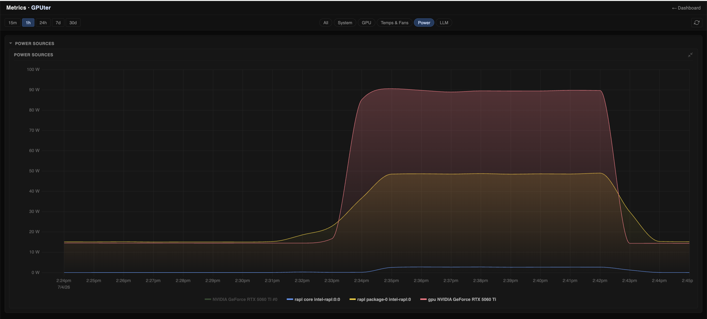
</a>

<a href="docs/images/metrics/rtx5060ti-utilization.png">
  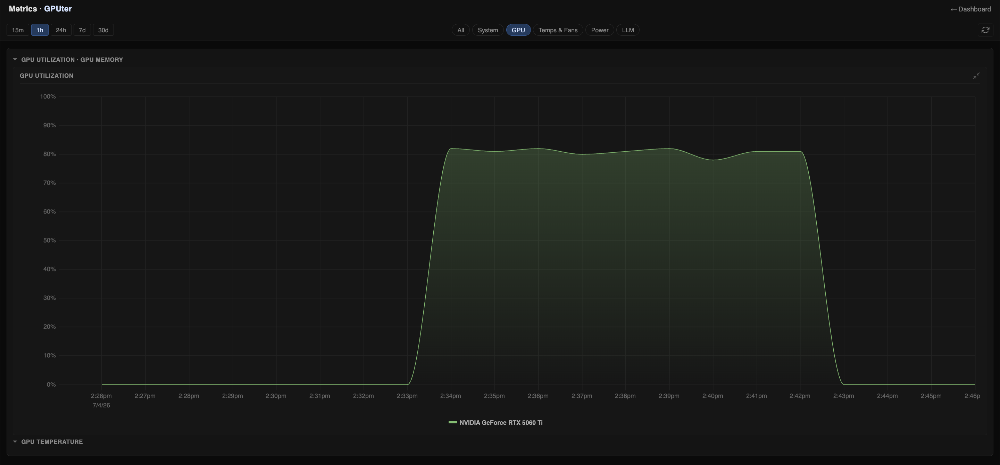
</a>

<a href="docs/images/metrics/rtx5060ti-temp.png">
  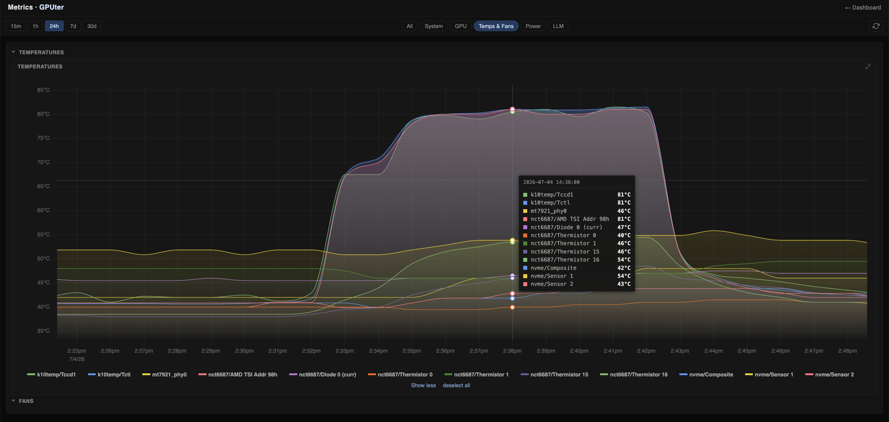
</a>

#### Intel Core Ultra iGPU

<a href="docs/images/metrics/igpu-power.png">
  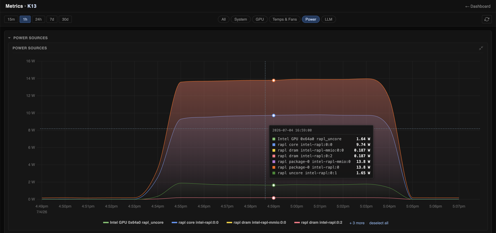
</a>

<a href="docs/images/metrics/igpu-utilization.png">
  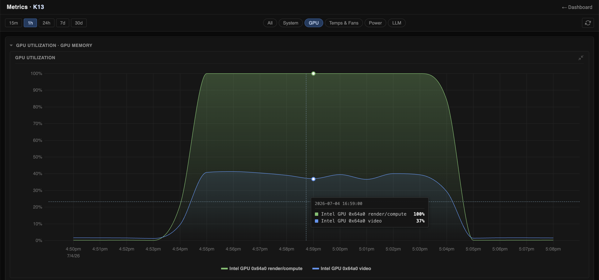
</a>

<a href="docs/images/metrics/igpu-temp.png">
  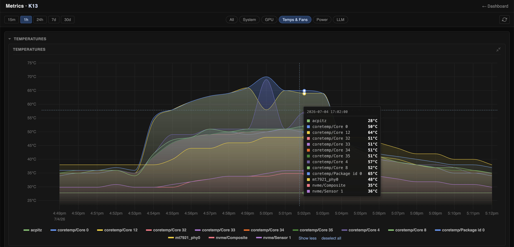
</a>

#### Intel Core Ultra NPU

<a href="docs/images/metrics/npu-power.png">
  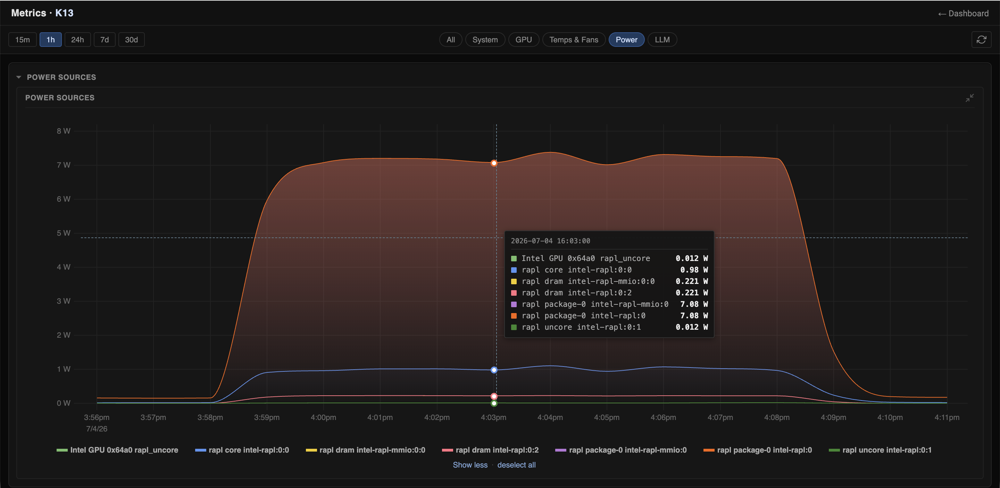
</a>

<a href="docs/images/metrics/npu-gpu-utilization.png">
  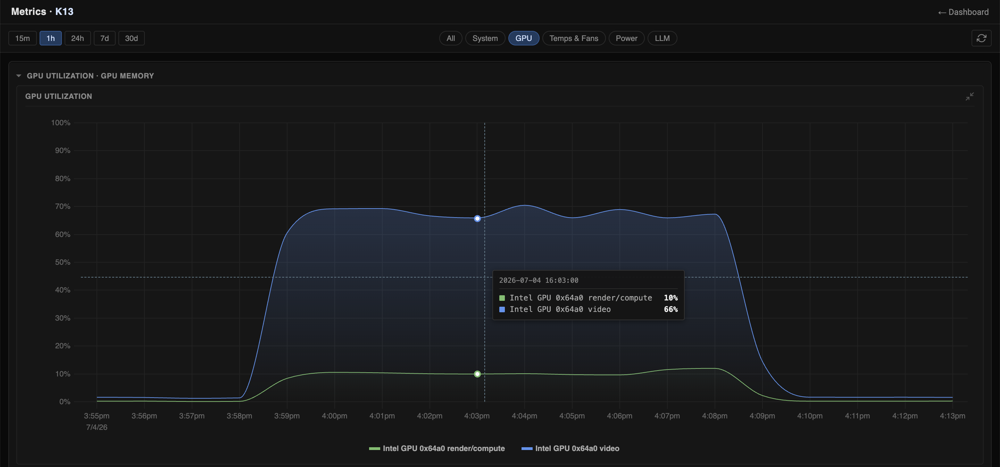
</a>

<a href="docs/images/metrics/npu-temp.png">
  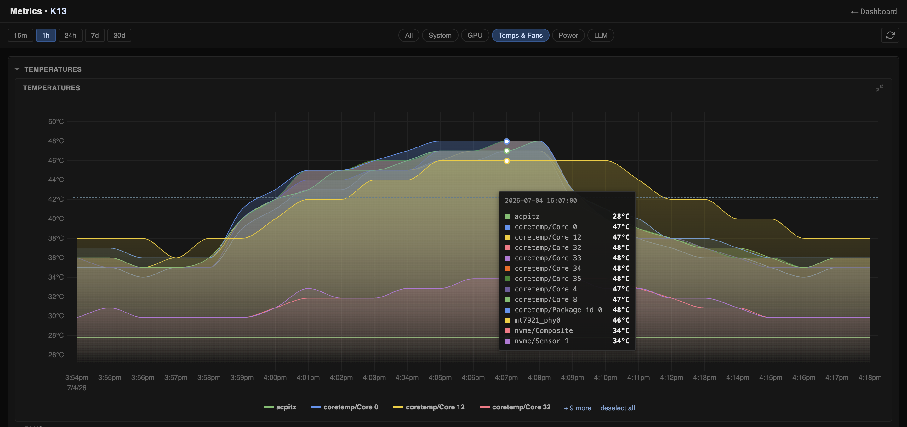
</a>

### Detection Counts

The comparable 80,091-frame Intel NPU and Nvidia GPU runs produced identical
person counts and near-identical car counts:

| Label | Intel NPU | Nvidia RTX 5060 Ti |
|---|---:|---:|
| car | 1,240,338 | 1,241,152 |
| person | 16,698 | 16,698 |

### Sanity Check: Detection Counts

The VIRAT clip is a parking-lot scene with many parked vehicles, so the raw
object count looks large at first glance. The benchmark counts every detection
on every processed frame, not unique physical objects across time.

For the 10-minute run:

```text
car detections: 1,240,338
frames: 80,091
cars per frame: 1,240,338 / 80,091 = 15.49
```

Representative frame from 120 seconds into the clip:

<a href="docs/images/virat-frame-120s.jpg">
  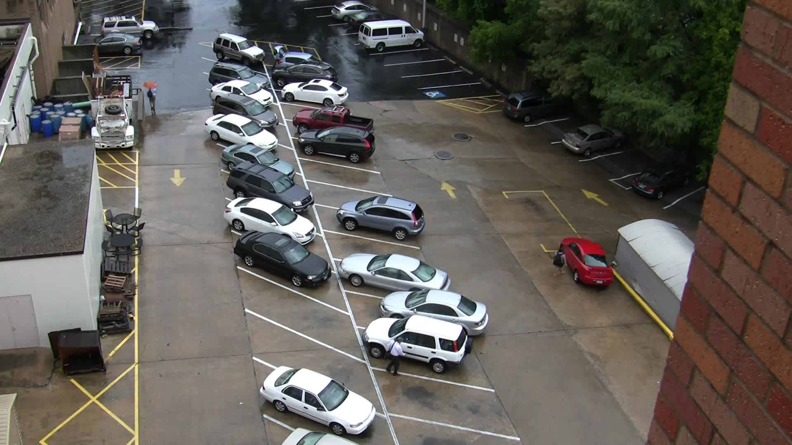
</a>

Visually, this frame contains roughly 25-30 visible vehicles, but many are
small, partially occluded, at the image edge, under trees, or classified as
trucks. Because the full 1920x1080 frame is resized to the detector input
shape of 320x320, an average of about 15-17 detected vehicles per frame is
plausible.

The benchmark also reports total detections per frame between 12 and 20 for
this run, which matches the scene density.

## Interpretation

The Nvidia GPU is the fastest single device in this benchmark, but only by
about 8 percent over the Intel NPU. The power gap is much larger: the Intel NPU
delivers about 11.1x better FPS/W in the measured configuration, which
translates to about $269 per year in electricity cost savings for one
always-on video AI workload.

The same efficiency advantage also matters for battery-powered autonomous
robots and drones, where lower power draw can extend runtime or leave more
energy budget for sensing, motion, and communication.

## Known Gaps

We publish these numbers as reproducible measurements, not the final word. If
you see a gap, mistake, or better comparison target, please send feedback so we
can get closer to the truth together.

The main missing comparison is power-efficient edge AI hardware. Two useful
next targets are:

| Target | Why it matters |
|---|---|
| Nvidia Jetson / Orin-class system | Compares Intel NPU against Nvidia hardware designed for edge AI, not a desktop GPU. |
| Newer Intel Core Ultra 9 or Core Ultra Series 3 system | Checks whether higher-end or newer Intel NPU/iGPU hardware changes the result. |
